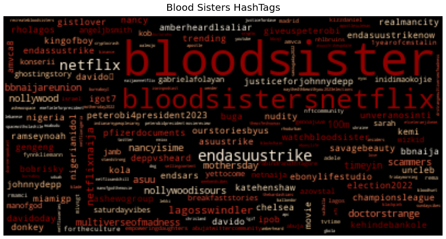
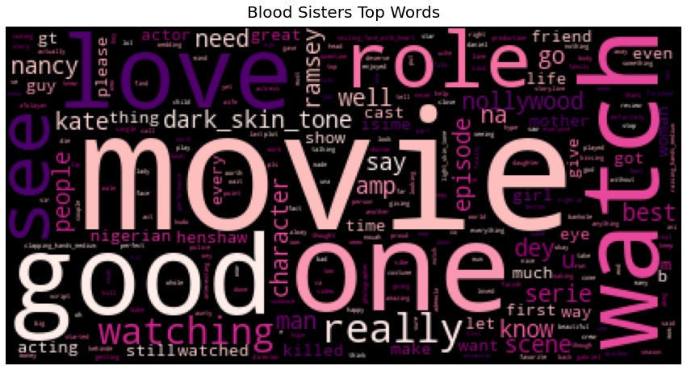
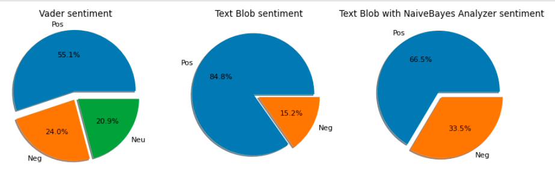

# Bloodsisters_sentiment
Sentiment analysis of tweets using #bloodsisters

## Table of contents

- [Overview](#overview)
  - [Screenshot](#screenshot)
  - [Links](#links)
- [My process](#my-process)
  - [Built with](#built-with)
  - [What I learned](#what-i-learned)
  - [Continued development](#continued-development)
  - [Useful resources](#useful-resources)
- [Author](#author)

## Overview

### Screenshot

 

### Links

- Dashboard incoming

## My process

### Built with

Python using libraries such as:
- Panel
- Pandas
- Numpy
- Snscrape
- Matplotlib
- Developer here api
- Textblob
- Tqdm etc.

### What I learned

Sentiment analysis and extraction of tweets

### Continued development

Thinking of creating a web app to easily pull tweets and make analysis.

### Useful resources

- [Vader repo](https://github.com/cjhutto/vaderSentiment)
- [TextBlob docs](https://textblob.readthedocs.io/en/dev/)
- [Tqdm repo](https://github.com/tqdm/tqdm#usage)
- [Jessica Bridgerton Analysis](https://nbviewer.org/github/jess-data/Bridgerton/blob/main/Bridgerton%20Twitter%20Analysis%20Project.ipynb)

## Author

- Twitter - [Ugochukwu](https://www.twitter.com/_EightKing)
